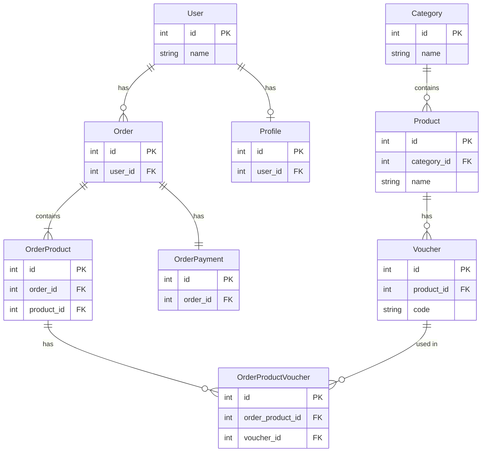

# 핵심 ERD

```mermaid
erDiagram
    User ||--o{ Order : has
    User ||--o| Profile : has
    Order ||--|{ OrderProduct : contains
    Order ||--|| OrderPayment : has
    OrderProduct ||--o{ OrderProductVoucher : has
    Category ||--o{ Product : contains
    Product ||--o{ Voucher : has
    Voucher ||--o{ OrderProductVoucher : "used in"

    User {
        int id PK
        string name
    }

    Profile {
        int id PK
        int user_id FK
    }

    Order {
        int id PK
        int user_id FK
    }

    OrderPayment {
        int id PK
        int order_id FK
    }

    OrderProduct {
        int id PK
        int order_id FK
        int product_id FK
    }

    OrderProductVoucher {
        int id PK
        int order_product_id FK
        int voucher_id FK
    }

    Category {
        int id PK
        string name
    }

    Product {
        int id PK
        int category_id FK
        string name
    }

    Voucher {
        int id PK
        int product_id FK
        string code
    }
```